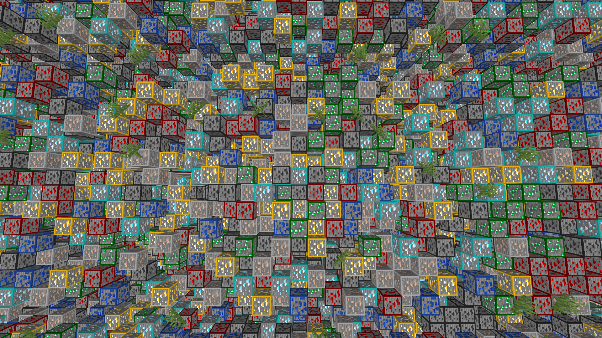

# ActualAntiXRay

This is an actual AntiXRay plugin for PocketMine-MP.

Unlike other so-called "AntiXRay" plugins, this one does not simply inform staff members if an ore is broken.
This plugin modifies the chunk packet sent to the client to make it look like a chunk contains a ridiculous amount of ores.

